<div align="center">


### AI-assisted AWS cost, security & resource optimization

Connect an AWS account, run a scan, and get a prioritized, priced list of what to fix — across EC2, S3, RDS, and IAM.

[](LICENSE)


[](#contributing)

[Overview](#overview) ·
[Features](#features) ·
[Architecture](#architecture) ·
[Screenshots](#screenshots) ·
[Installation](#installation) ·
[API](#api-overview) ·
[Roadmap](#roadmap)

</div>

---

## Table of Contents

1. [Overview](#overview)
2. [Problem Statement](#problem-statement)
3. [Features](#features)
4. [Architecture](#architecture)
5. [Folder Structure](#folder-structure)
6. [Technology Stack](#technology-stack)
7. [AWS Services Used](#aws-services-used)
8. [Authentication](#authentication)
9. [Recommendation Engine](#recommendation-engine)
10. [Dashboard](#dashboard)
11. [Cost Optimization](#cost-optimization)
12. [Security Analysis](#security-analysis)
13. [Workflow](#workflow)
    - [Application Flow](#application-flow)
    - [Recommendation Flow](#recommendation-flow)
14. [Database Models](#database-models)
15. [API Overview](#api-overview)
16. [Installation](#installation)
17. [Environment Variables](#environment-variables)
18. [Running Locally](#running-locally)
19. [Deployment](#deployment)
20. [Screenshots](#screenshots)
21. [Architecture Diagrams](#architecture-diagrams)
22. [Roadmap](#roadmap)
23. [Contributing](#contributing)
24. [License](#license)
25. [Author](#author)

---

## Overview

**CloudLens** is a full-stack AWS cost-optimization and cloud-security-posture dashboard. You connect a read-only-scoped AWS account, click **Run Scan**, and CloudLens walks EC2, S3, RDS, and IAM, cross-references live CloudWatch metrics and AWS Price List pricing, and turns the raw output into a single prioritized table of recommendations — each with a severity, a category (cost / security / performance / reliability), a plain-English reason, and an estimated dollar impact.

It's built as a realistic, production-shaped MERN application: a layered Express API (`routes → controllers → services → repositories`), a normalized MongoDB schema, a typed request pipeline through the AWS SDK v3, and a React 19 frontend with real charts, filters, and drill-down views — not a toy CRUD demo.

## Problem Statement

Cloud spend grows quietly. A `t3.large` someone spun up for a two-week experiment is still running eight months later. A security group still allows `0.0.0.0/0` on a database port from a demo that shipped. An IAM user has `AdministratorAccess` and no MFA because it was faster to grant than to scope. AWS's own tools either show *spend* (Cost Explorer) without connecting it to *specific misconfigured resources*, or show *resources* (the console) without connecting them to *cost or risk*.

CloudLens exists to close that gap for a small-to-mid-size AWS account: one scan, one prioritized list, one number for "how much could this save me," per finding — cost and security findings side by side, because in practice the same audit usually needs to answer both questions at once.

## Features

| | |
|---|---|
| 🔍 **Multi-service scanning** | EC2 (+ EBS volumes, Elastic IPs), S3, RDS, and IAM (users, roles, and the root account) in a single scan |
| 💰 **Priced recommendations** | Every cost finding is priced against the live AWS Price List API — not a flat estimate |
| 🛡️ **Security findings** | Public S3 buckets, unencrypted RDS storage, open security groups, admin IAM users without MFA, stale access keys, unused roles |
| ✨ **AI Insights** | Rule-based (no LLM, fully deterministic) fleet-wide summaries — "2 IAM users have excessive permissions," "1 RDS instance has low utilization" |
| 📊 **Interactive dashboard** | Severity breakdown, cost-by-service, resource distribution, and top savings-opportunities charts (Recharts) |
| 🖥️ **EC2 Fleet & IAM Security Insights** | Dedicated fleet-health cards: average CPU/network/disk, idle & old instances, MFA coverage, admin users, stale keys |
| 🗂️ **Filterable recommendation table** | Search, filter by severity/status/resource type, sort, paginate, and act — Ignore / Resolve / Stop |
| 🔎 **Resource Details Drawer** | Per-resource deep dive with type-specific fields and one-click AWS Console deep links |
| 🕘 **Scan History** | Every past scan, with a full per-scan resource + recommendation breakdown |
| 📄 **PDF report export** | One-click PDF of any scan's findings, generated server-side with `pdfkit` |
| ⏰ **Scheduled scans** | Hourly / daily / weekly automatic re-scans via `node-cron` |
| 📧 **Email notifications** | Scan-completed, high-severity-found, and weekly-digest emails via Nodemailer (Ethereal preview in dev) |
| 📈 **Cost analytics trends** | Monthly cost, estimated savings, resource growth, and high-alert count charted across every scan |
| 📜 **Audit log** | Every significant account action (login, scan run, recommendation resolved, AWS account connected, ...) |
| 🔐 **JWT auth + logout-everywhere** | `tokenVersion`-based invalidation — no server-side token blacklist needed |
| 🔒 **Encrypted credentials at rest** | Connected AWS secret access keys are AES-256-GCM encrypted before they ever reach MongoDB |
| 📱 **Fully responsive** | Every page works down to a phone-width viewport |

## Architecture

```
User → React Frontend (Vite) → Axios (JWT attached)
     → Express Routes → protect middleware → Controllers → Services
                                                              ├── Repositories → MongoDB Atlas
                                                              └── AWS SDK v3 clients → EC2 · S3 · RDS · IAM · CloudWatch · Pricing · STS
```

The backend is strictly layered: **routes** wire an HTTP method + path to a controller, **controllers** parse the request and call exactly one service function, **services** hold the business logic and orchestrate repositories and/or AWS SDK calls, and **repositories** are the *only* layer allowed to import a Mongoose model directly. Every scanned AWS service (EC2/S3/RDS/IAM) follows the same internal pipeline — see [Recommendation Engine](#recommendation-engine) below.

<p align="center">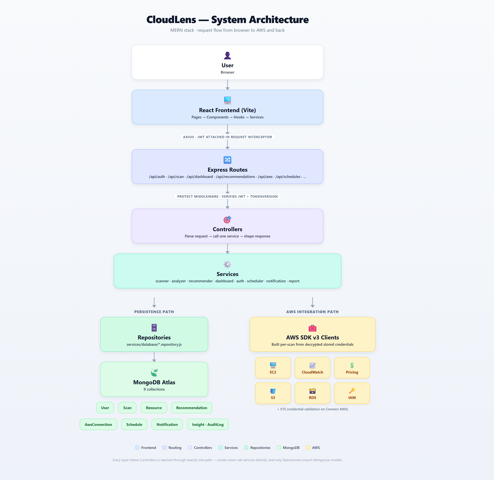</p>

## Folder Structure

```
CloudLens/
├── client/                      # React 19 + Vite frontend
│   └── src/
│       ├── pages/                # One component per route (Dashboard, Recommendations, ScanDetail, ...)
│       ├── components/           # Reusable UI — tables, charts, cards, drawers, filters
│       ├── services/              # One thin function per API endpoint (axios wrappers)
│       ├── hooks/                 # useAsyncData, useScanTrigger, ...
│       ├── api/                   # Shared Axios instance + interceptors
│       └── utils/                 # Formatting, badge styling, AWS console URL builders
│
├── server/                      # Express 5 + Mongoose 9 backend
│   └── src/
│       ├── routes/                # Express routers — one file per resource
│       ├── controllers/           # asyncHandler-wrapped request handlers
│       ├── services/
│       │   ├── scanner/            # scanEC2 / scanS3 / scanRDS / scanIAM — one per AWS service
│       │   ├── analyzer/           # Pure functions: raw data → derived booleans/metrics
│       │   ├── recommender/        # Pure functions: analysis → { severity, action, recommendation }
│       │   ├── aws/                # Thin AWS SDK v3 client wrappers
│       │   ├── database/           # Repositories — the only layer touching Mongoose models
│       │   ├── dashboard/          # Aggregation for the dashboard payload
│       │   └── insight/            # Rule-based AI Insights generation
│       ├── mappers/               # Normalize raw AWS SDK responses into a consistent shape
│       ├── calculator/            # Pricing → monthly cost / estimated savings math
│       ├── builders/ · parser/    # AWS Price List API filter builders + response parsing
│       ├── models/                # 9 Mongoose schemas
│       ├── middleware/            # auth (JWT), error handling, rate limiting, validation
│       └── utils/                 # Encryption (AES-256-GCM), API response envelope, ...
│
└── docs/
    ├── screenshots/               # Product screenshots (this README)
    └── diagrams/                  # Architecture / flow / schema diagrams (this README)
```

<p align="center">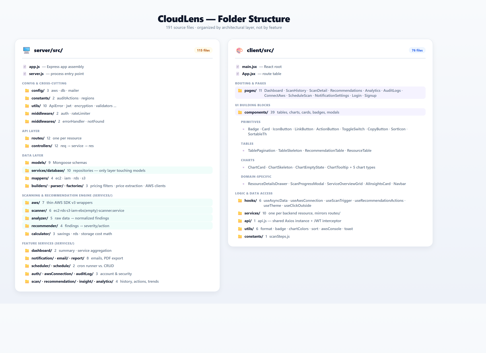</p>

## Technology Stack

<table>
<tr><td valign="top">

**Frontend**

| Package | Version |
|---|---|
| react / react-dom | ^19.2.7 |
| react-router-dom | ^7.18.1 |
| axios | ^1.18.1 |
| recharts | ^3.9.2 |
| framer-motion | ^12.42.2 |
| tailwindcss / @tailwindcss/vite | ^4.3.3 |
| react-hot-toast | ^2.6.0 |
| react-icons | ^5.7.0 |
| react-loading-skeleton | ^3.5.0 |
| vite | ^8.1.1 |

</td><td valign="top">

**Backend**

| Package | Version |
|---|---|
| express | ^5.2.1 |
| mongoose | ^9.7.4 |
| @aws-sdk/client-{ec2,s3,rds,iam,cloudwatch,pricing,sts} | ^3.108x–3.109x |
| jsonwebtoken | ^9.0.3 |
| bcrypt | ^6.0.0 |
| node-cron | ^4.6.0 |
| nodemailer | ^9.0.3 |
| pdfkit | ^0.19.1 |
| express-rate-limit | ^8.6.1 |
| dotenv | ^17.4.2 |

</td></tr>
</table>

**Database:** MongoDB Atlas · 9 Mongoose collections — see [Database Models](#database-models)

## AWS Services Used

| Service | What CloudLens reads | Used for |
|---|---|---|
| **EC2** | Instances, EBS volumes, Elastic IPs, security groups | Right-sizing, idle detection, unattached volumes, open security groups, unassociated Elastic IPs |
| **S3** | Bucket list, region, ACL/policy, encryption, versioning, lifecycle rules, storage-class distribution | Public-access detection, encryption gaps, lifecycle/tiering opportunities |
| **RDS** | DB instances — engine, storage, Multi-AZ, encryption, backups, public accessibility | Public access, missing encryption/backups, oversized/idle instances, outdated engine versions |
| **IAM** | Users, roles, policies (attached/inline/customer-managed), access keys, MFA status, root account summary | Admin access without MFA, wildcard permissions, stale/unused access keys, unused roles, root account hygiene |
| **CloudWatch** | `GetMetricData` — CPU, network, disk I/O (EC2/RDS), storage bytes (S3) | Utilization-based recommendations (idle / oversized) |
| **Pricing** | AWS Price List API (`GetProducts`) | Converts a resource's configuration into a real `$/month` figure, not a flat estimate |
| **STS** | `GetCallerIdentity` | Validates a connected account's credentials and resolves its Account ID on **Test Connection** |

> **CloudLens only ever calls read-only, `Describe*` / `List*` / `Get*` AWS API actions.** It never creates, modifies, or deletes anything in a connected AWS account — the credentials it asks for only need read access to be fully functional. See the IAM policy suggestion in [Installation](#installation).

## Authentication

- **Signup / Login** — `bcrypt`-hashed passwords, a 7-day JWT issued on login, and rate-limiting on the login endpoint specifically (`express-rate-limit`) to slow down credential-stuffing attempts.
- **`protect` middleware** — every route except `/api/auth/*` requires a valid `Authorization: Bearer <JWT>` header. The middleware verifies the signature, then checks the token's `tokenVersion` claim against the current value on the `User` document.
- **Logout everywhere** — bumping `User.tokenVersion` instantly invalidates every previously-issued JWT for that user, without needing a server-side token blacklist or Redis.
- **AWS credentials at rest** — a connected account's secret access key is encrypted with **AES-256-GCM** (`server/src/utils/encryption.js`) before it's saved; the access key ID is stored in plaintext (needed to make the AWS calls), the secret never is. `AwsConnection.toJSON()` also strips the encrypted field from every API response as defense in depth.

## Recommendation Engine

Every scanned resource goes through the same five-stage pipeline, independently per AWS service:

<p align="center">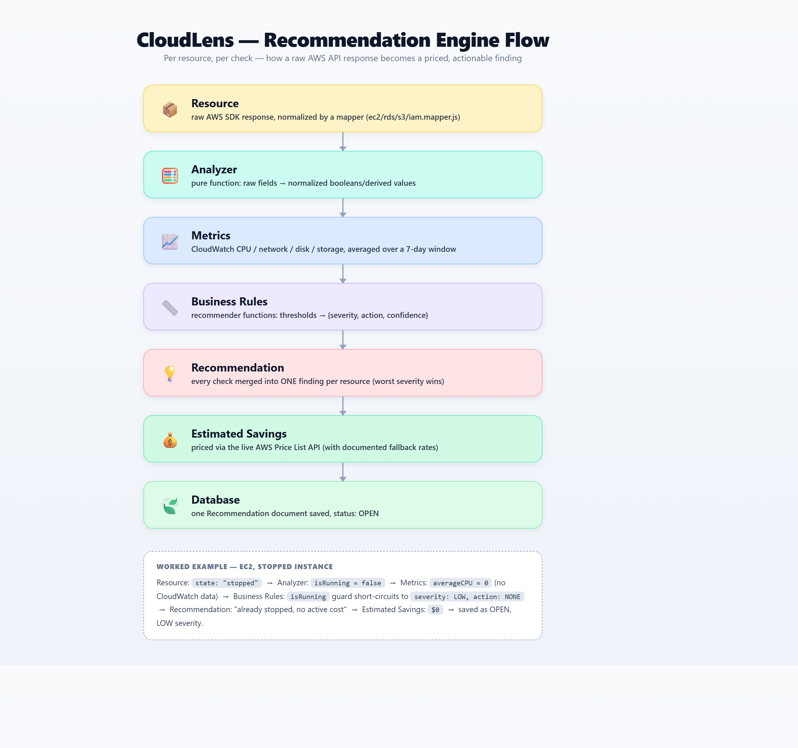</p>

1. **Mapper** — normalizes the raw AWS SDK response (`DescribeInstances`, `ListBuckets`, ...) into a consistent internal shape.
2. **Analyzer** — pure functions that reduce that shape into booleans and derived numbers (`isPublic`, `averageCpu`, `hasAdminAccess`, `instanceAgeDays`, ...). Analyzers never touch the network or the database.
3. **CloudWatch metrics** — merged in for EC2/RDS (CPU/network/disk) and S3 (storage bytes) so utilization-based rules have real numbers to work with.
4. **Recommender** — threshold-based business rules turn the analysis into one or more `{ severity, action, recommendation, reason }` candidates (e.g. "CPU < 5% while running" → `DOWNSIZE`, medium severity).
5. **Merge → price → save** — every candidate recommendation for one resource is merged into a **single** `Recommendation` document (worst severity wins), priced against the AWS Price List API, and saved as `status: "OPEN"`.

A resource's actual state is always checked before a utilization-based rule fires — a **stopped** EC2 instance or RDS database has no CloudWatch datapoints at all, which reads as `0`, identical to "running but completely idle." Without that state check, every stopped resource would be permanently misflagged as a cost problem it isn't. The same guard exists in the AI Insights rules.

## Dashboard

The dashboard aggregates the latest scan into one view: top-line stats (total resources, monthly cost, estimated savings, alert counts), an **AI Insights** panel, per-service resource/recommendation/savings summary cards, dedicated **EC2 Fleet Insights** and **IAM Security Insights** sections, and four charts — resource health by severity, cost breakdown by service, resource distribution, and top savings opportunities.

<p align="center">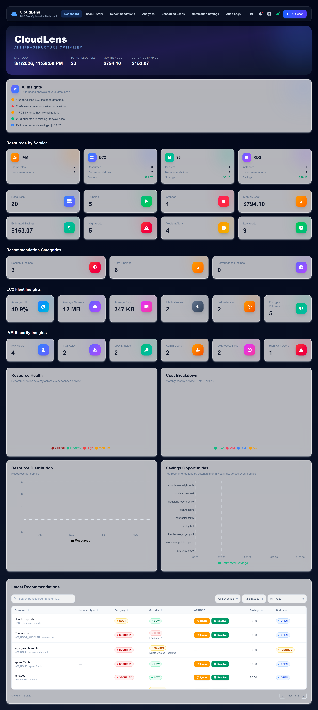</p>

## Cost Optimization

- **`monthlyCost`** on a recommendation always reflects real, current infrastructure spend, so it's summed **without** filtering by status — resolving or ignoring a recommendation is a tracking action, it doesn't change what AWS is actually billing.
- **`estimatedSavings`**, severity counts, and category counts are summed **only** over `status: "OPEN"` recommendations — a resolved or ignored finding is no longer outstanding work, so it shouldn't keep inflating "how much could I still save."
- Every priced recommendation uses the **live AWS Price List API** for the resource's actual instance type / region / engine, not a static lookup table — and for EC2 `UPSIZE`/`DOWNSIZE` suggestions, CloudLens also prices the *target* instance type so the recommendation's savings number reflects the real delta, not a guess.

## Security Analysis

IAM findings cover admin access without MFA, wildcard (`*:*`) permissions, access keys older than the rotation threshold or unused for 90+ days, roles that have never been assumed, and root-account hygiene (MFA, lingering access keys) — the single most consequential AWS security posture, and the first thing CloudLens checks. RDS findings cover public accessibility, disabled storage encryption, zero backup retention, and outdated engine versions. S3 findings cover public bucket policies/ACLs, disabled encryption, and missing lifecycle configuration. EC2 findings include security groups open to `0.0.0.0/0`.

<p align="center">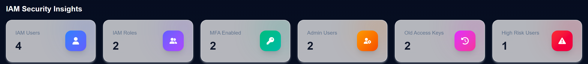</p>

## Workflow

### Application Flow

Every REST call in the app — read or write — travels the same nine-stage path, both directions:

<p align="center">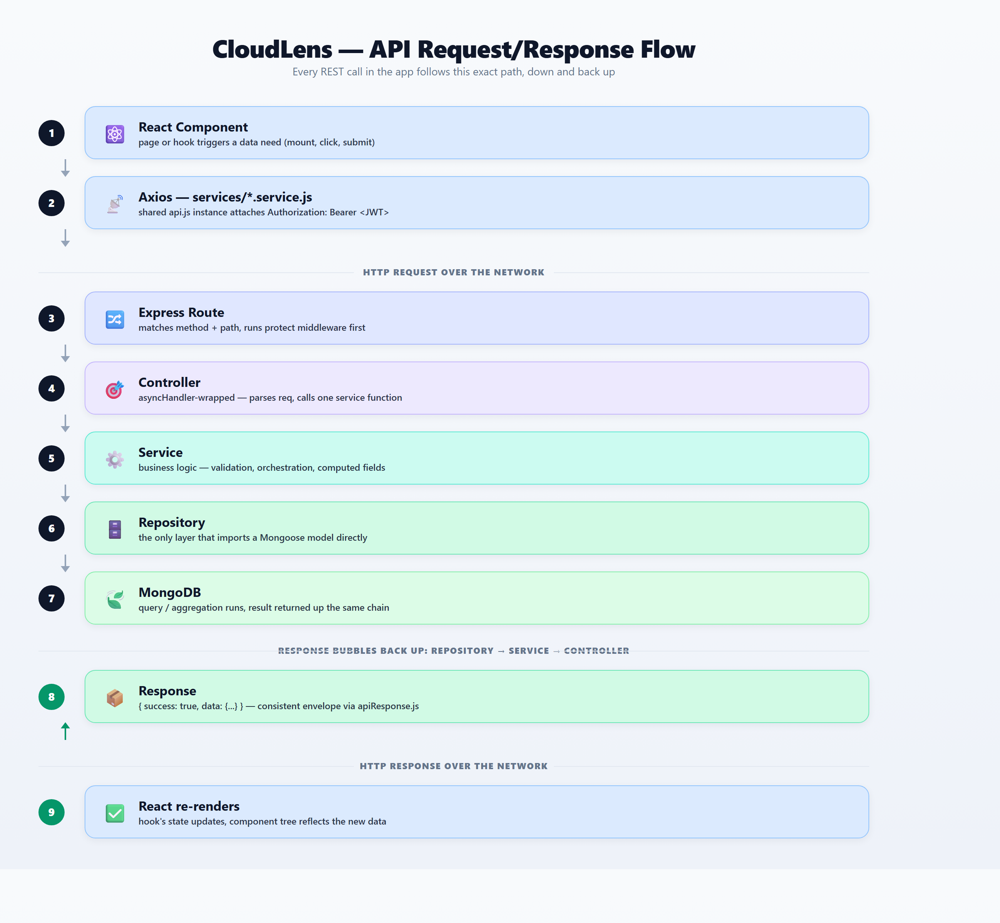</p>

<details>
<summary><b>Backend internals</b> — middleware stack, auth, and error handling</summary>
<br>
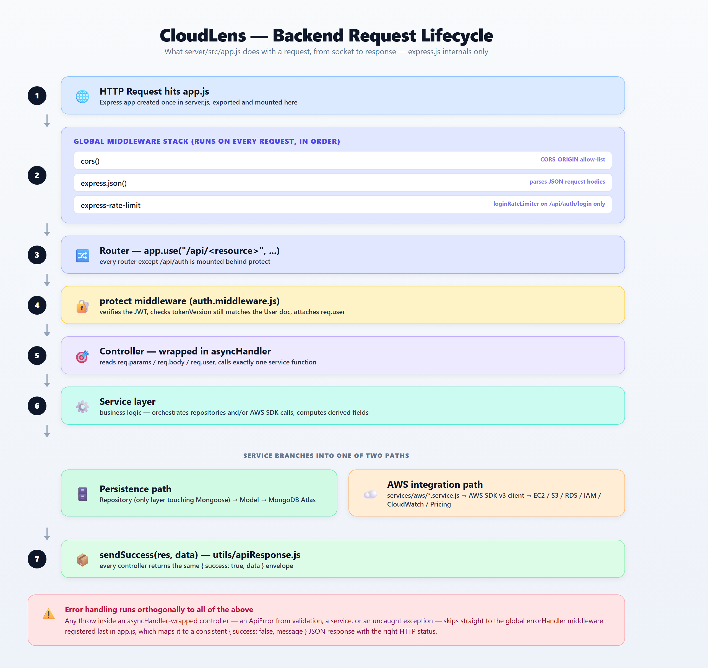
</details>

<details>
<summary><b>Frontend internals</b> — hooks, services, and the render cycle</summary>
<br>
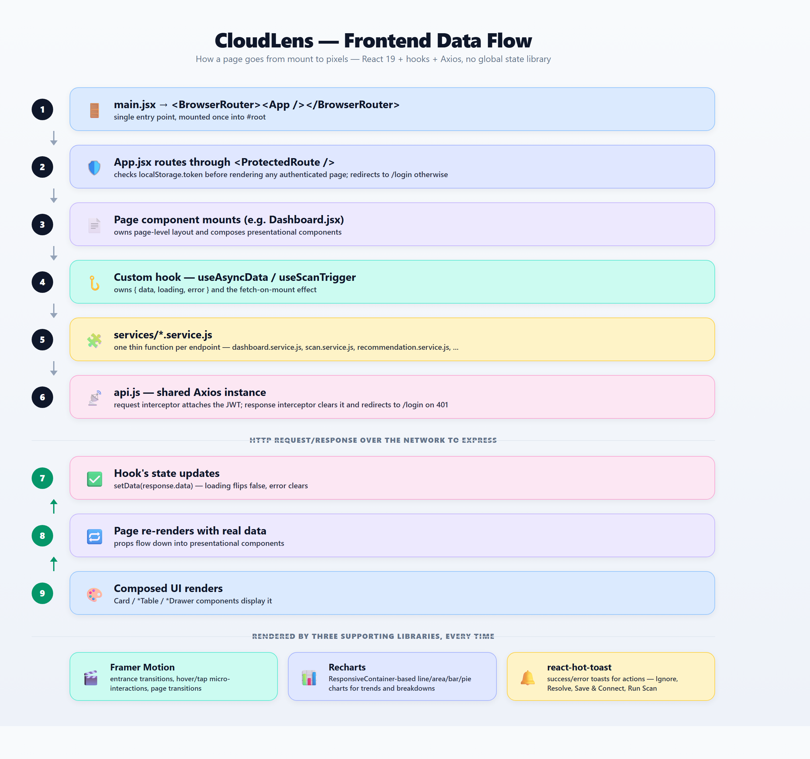
</details>

**Clicking "Run Scan," step by step:** `Navbar` → `useScanTrigger` hook → `POST /api/scan` → `scan.controller.js` → `scan.service.js`, which runs `scanEC2` (blocking — a failure here fails the whole scan), then `scanS3`, `scanRDS`, `scanIAM` in sequence, each independently fault-tolerant (a missing permission degrades that service's contribution to zero instead of aborting the scan). Each scanner saves its own `Resource` + `Recommendation` documents as it goes; when all four finish, the `Scan` document is marked `COMPLETED` with its totals, and the frontend re-fetches the dashboard.

<p align="center">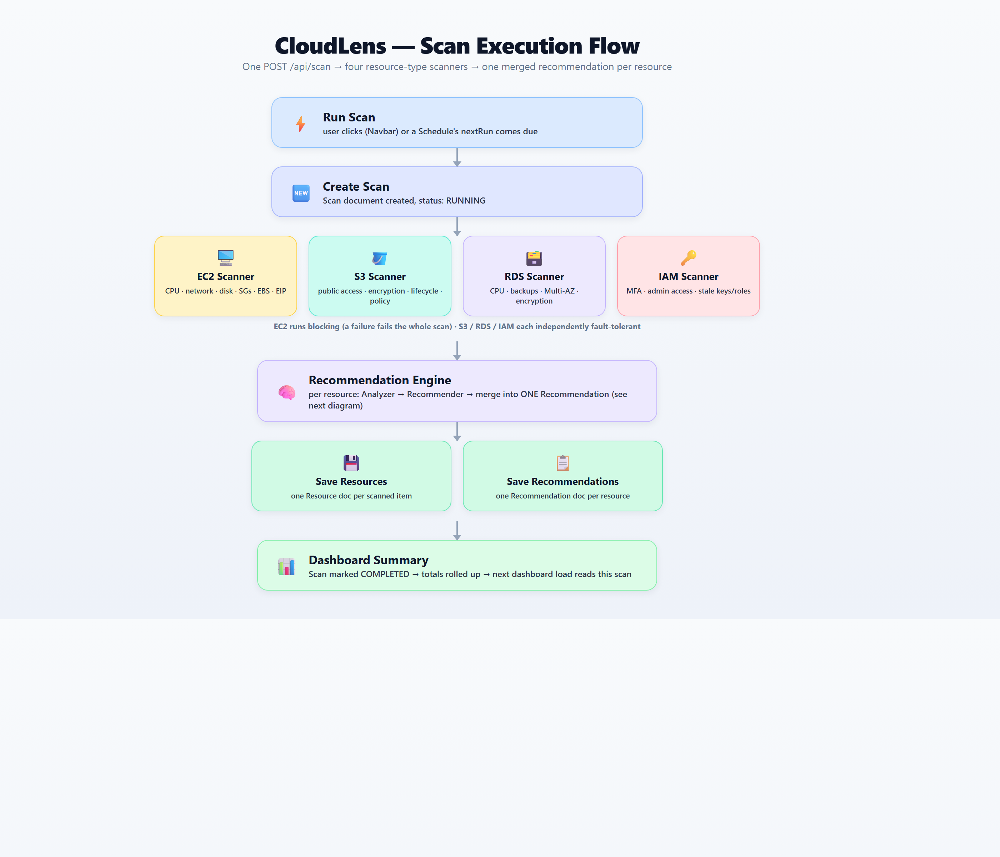</p>

### Recommendation Flow

Covered in detail above — see [Recommendation Engine](#recommendation-engine).

## Database Models

MongoDB Atlas, 9 collections, every one scoped by a plain `userId` field rather than Mongoose `ref`/`.populate()` — every cross-collection read is an explicit, visible query in the repository layer.

<p align="center">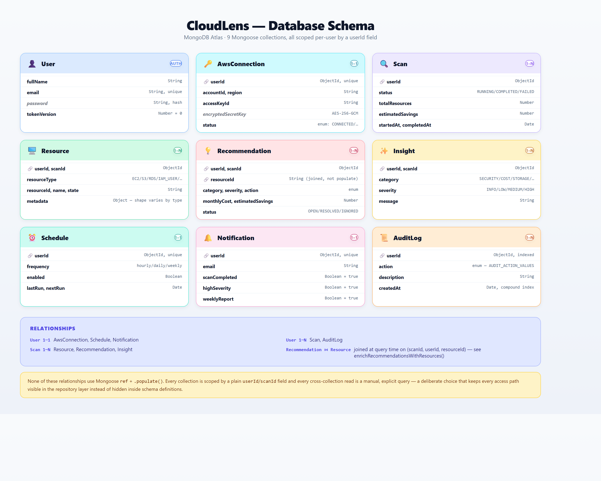</p>

| Collection | Purpose | Key relationship |
|---|---|---|
| `User` | Account + hashed password + `tokenVersion` | — |
| `AwsConnection` | One connected AWS account per user, secret AES-256-GCM encrypted | 1–1 with `User` |
| `Scan` | One document per scan run — status, totals, timing | 1–N from `User` |
| `Resource` | Every resource discovered in a scan, with type-specific `metadata` | 1–N from `Scan` |
| `Recommendation` | One finding per resource — severity, action, pricing, status | 1–N from `Scan`; joined to `Resource` by `resourceId` at query time |
| `Insight` | Rule-based fleet-wide AI Insights for a scan | 1–N from `Scan` |
| `Schedule` | A user's automatic re-scan cadence (`node-cron`) | 1–1 with `User` |
| `Notification` | A user's email notification preferences | 1–1 with `User` |
| `AuditLog` | Timestamped account activity log | 1–N from `User` |

## API Overview

Every route below except `/api/auth/*` runs behind the `protect` JWT middleware. Every response uses the same envelope: `{ success: true, data }` or `{ success: false, message }`.

| Method | Endpoint | Description |
|---|---|---|
| `POST` | `/api/auth/signup` | Create an account |
| `POST` | `/api/auth/login` | Log in (rate-limited) |
| `POST` | `/api/auth/logout-all` | Invalidate every issued JWT for this user |
| `POST` | `/api/scan` | Run a new scan across all connected AWS services |
| `GET` | `/api/scans` | List scan history |
| `GET` | `/api/scans/:id` | One scan's full resources + recommendations |
| `GET` | `/api/dashboard` | Aggregated dashboard payload |
| `GET` | `/api/dashboard/recommendations` | Latest scan's recommendations (dashboard widget) |
| `GET` | `/api/recommendations` | Latest scan's recommendations (full table) |
| `PATCH` | `/api/recommendations/:id/ignore` | Mark a recommendation ignored |
| `PATCH` | `/api/recommendations/:id/resolve` | Mark a recommendation resolved |
| `POST` | `/api/recommendations/:id/stop` | Stop the underlying resource (e.g. an idle EC2 instance) |
| `POST` | `/api/aws/test-connection` | Validate AWS credentials via STS before saving |
| `POST` | `/api/aws/connect` | Save a connected AWS account |
| `GET` | `/api/aws/account` | Get the connected account's public info |
| `DELETE` | `/api/aws/disconnect` | Remove the connected AWS account |
| `GET` / `POST` / `PATCH` / `DELETE` | `/api/schedules` | Manage the automatic re-scan schedule |
| `GET` / `PATCH` | `/api/notifications/settings` | Manage email notification preferences |
| `GET` | `/api/analytics/cost-trend` | Monthly cost across every scan |
| `GET` | `/api/analytics/savings-trend` | Estimated savings across every scan |
| `GET` | `/api/analytics/resource-growth` | Total resources across every scan |
| `GET` | `/api/analytics/high-alerts-trend` | High-severity count across every scan |
| `GET` | `/api/reports/scan/:id` | Export a scan as a PDF report |
| `GET` | `/api/audit-logs` | This user's activity log |
| `GET` | `/api/health` | Liveness check |

## Installation

**Prerequisites:** Node.js 20+, a MongoDB connection string (Atlas or local), and an AWS account with a read-only-scoped IAM user if you want to actually run a scan (`ReadOnlyAccess`, or a custom policy limited to `ec2:Describe*`, `s3:GetBucket*`, `s3:ListAllMyBuckets`, `rds:Describe*`, `iam:Get*`, `iam:List*`, `cloudwatch:GetMetricData`, `cloudwatch:ListMetrics`, `pricing:GetProducts`, `sts:GetCallerIdentity`).

```bash
git clone https://github.com/Akshat295/CloudLens.git
cd CloudLens

# Backend
cd server
npm install
cp .env.example .env   # then fill in the values — see below

# Frontend
cd ../client
npm install
cp .env.example .env   # optional — only needed if the API isn't on localhost:5000
```

## Environment Variables

**`server/.env`**

| Variable | Required | Description |
|---|---|---|
| `PORT` | No (default `5000`) | Port the Express server listens on |
| `MONGO_URI` | **Yes** | MongoDB connection string |
| `AWS_REGION` | **Yes** | Default AWS region for SDK clients |
| `CORS_ORIGIN` | No (default `http://localhost:5173`) | Comma-separated allowed frontend origin(s) |
| `JWT_SECRET` | **Yes** | Signing secret for auth tokens |
| `JWT_EXPIRES_IN` | No (default `7d`) | Token lifetime |
| `ENCRYPTION_KEY` | **Yes** | 32-byte hex key (64 hex chars) — encrypts stored AWS secret keys. Generate with `node -e "console.log(require('crypto').randomBytes(32).toString('hex'))"` |
| `SMTP_HOST` / `SMTP_PORT` / `SMTP_SECURE` / `SMTP_USER` / `SMTP_PASS` | No | Real SMTP provider; omit to auto-provision an Ethereal test inbox in development |
| `EMAIL_FROM` | No | Sender header for outgoing email |

**`client/.env`**

| Variable | Required | Description |
|---|---|---|
| `VITE_API_URL` | No (default `http://localhost:5000/api`) | Base URL the frontend calls |

## Running Locally

```bash
# Terminal 1 — backend (http://localhost:5000)
cd server
npm run dev

# Terminal 2 — frontend (http://localhost:5173)
cd client
npm run dev
```

Open `http://localhost:5173`, sign up, connect an AWS account (or explore the UI without one — every page degrades gracefully to an empty state), and run a scan.

## Deployment

There's no CI/CD pipeline or hosting config committed to this repo yet — deploying is a manual, standard MERN split:

- **Frontend** — `npm run build` in `client/` produces a static `dist/` bundle, deployable to any static host (Vercel, Netlify, Cloudflare Pages, S3 + CloudFront).
- **Backend** — `server/` is a plain Node/Express process (`npm start`), deployable to any Node host (Render, Railway, Fly.io, an EC2 instance behind a reverse proxy).
- **Database** — already MongoDB Atlas; no migration needed.

Set `CORS_ORIGIN` on the backend to the deployed frontend's origin, and `VITE_API_URL` on the frontend to the deployed backend's URL, at build time.

## Screenshots

<table>
<tr>
<td width="50%"><b>Login</b><br>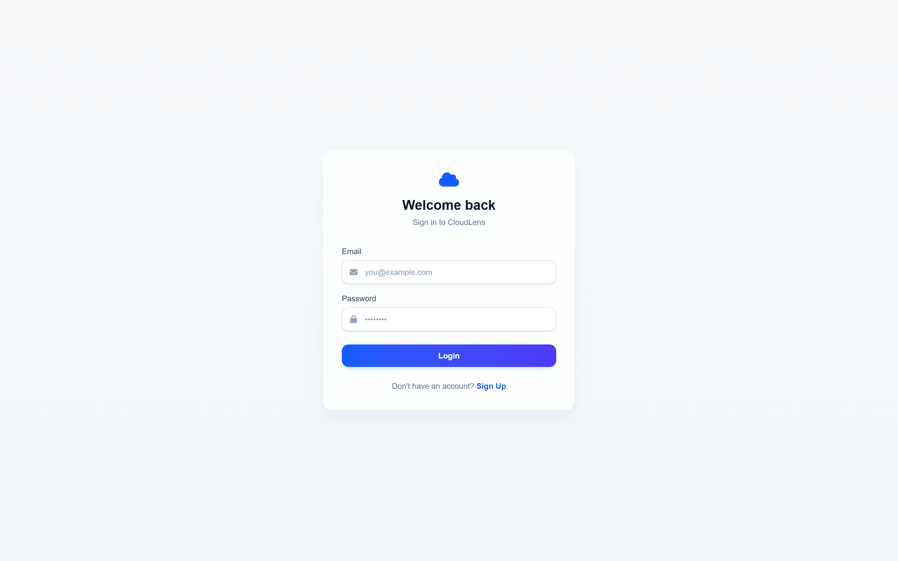</td>
<td width="50%"><b>Sign Up</b><br>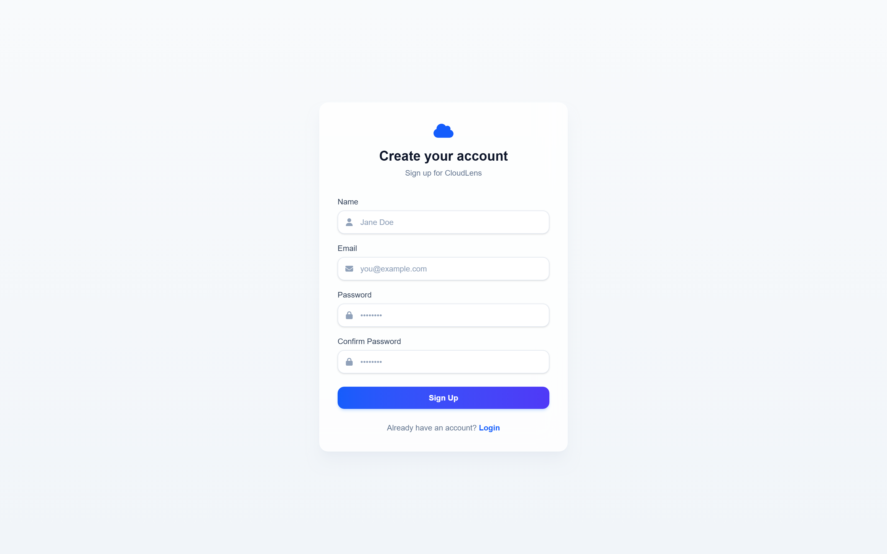</td>
</tr>
<tr>
<td colspan="2"><b>Dashboard</b><br></td>
</tr>
<tr>
<td width="50%"><b>AI Insights</b><br>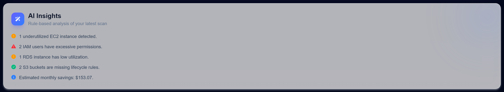</td>
<td width="50%"><b>AWS Connection</b><br>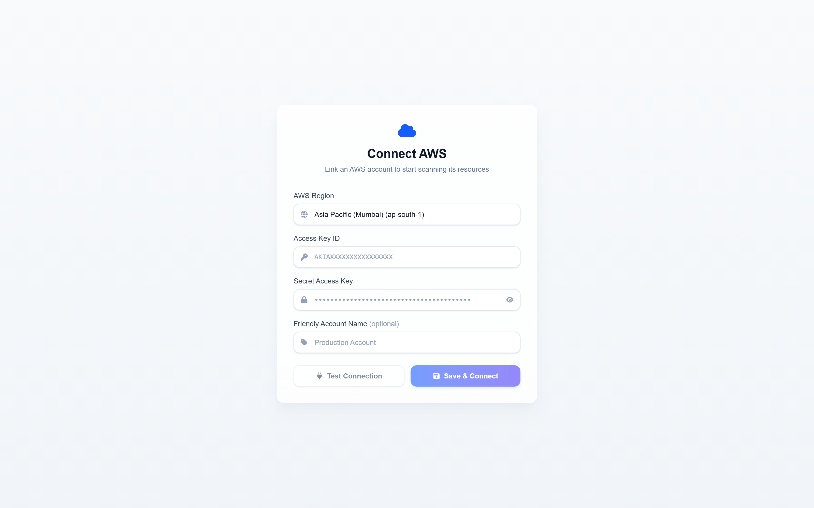</td>
</tr>
<tr>
<td colspan="2"><b>Recommendation Table</b><br>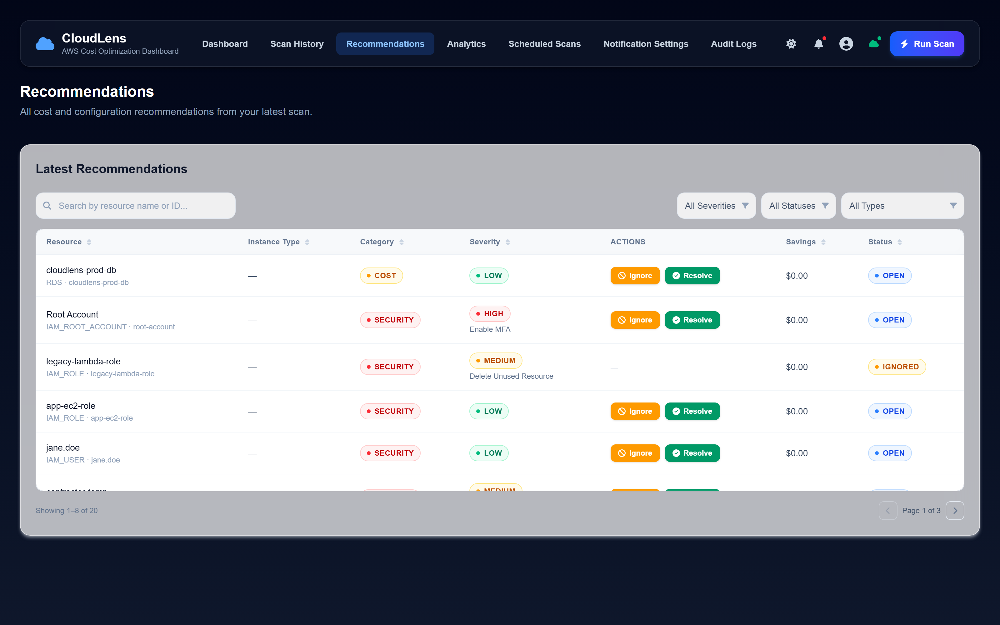</td>
</tr>
<tr>
<td width="50%"><b>Resource Table</b><br>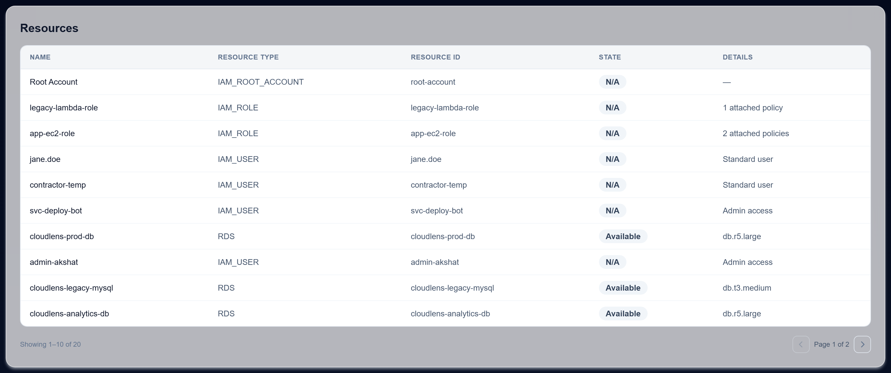</td>
<td width="50%"><b>Resource Details Drawer</b><br>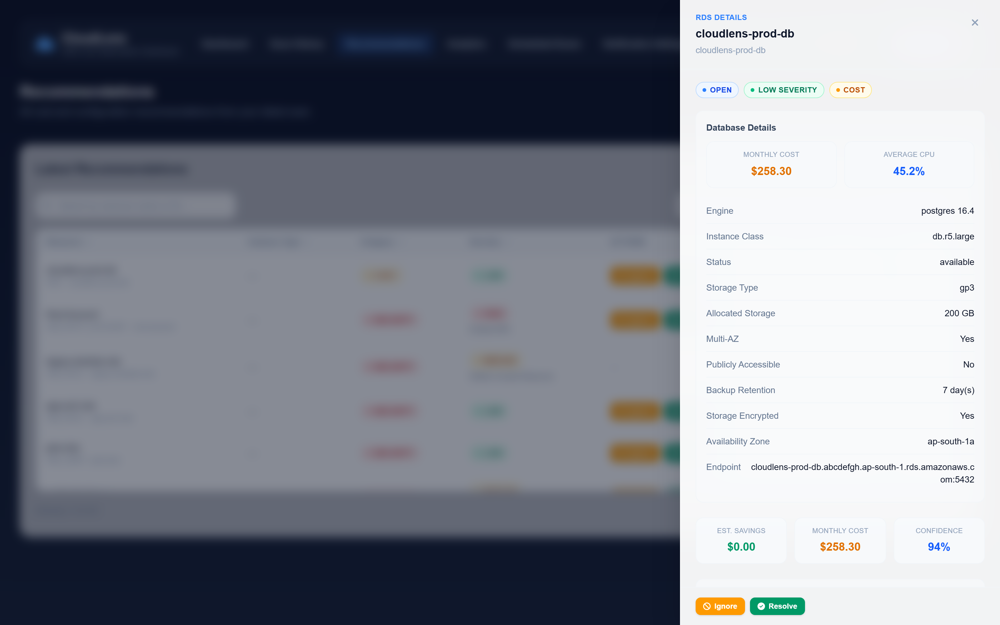</td>
</tr>
<tr>
<td width="50%"><b>Scan History</b><br>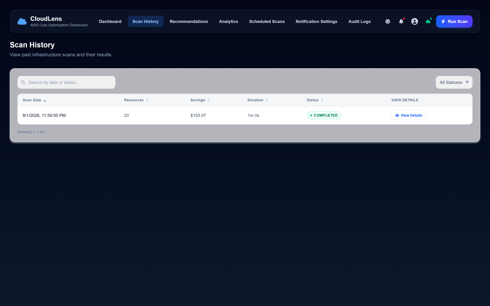</td>
<td width="50%"><b>Cost Analytics Charts</b><br>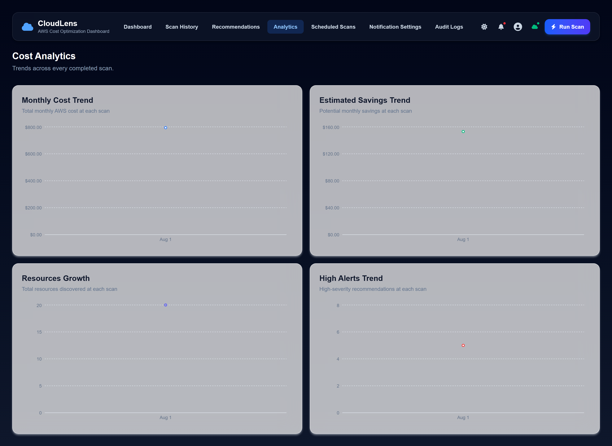</td>
</tr>
<tr>
<td width="50%"><b>EC2 Fleet Insights</b><br>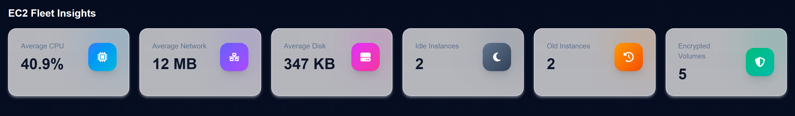</td>
<td width="50%"><b>IAM Security Insights</b><br></td>
</tr>
<tr>
<td width="50%"><b>S3 Findings</b><br>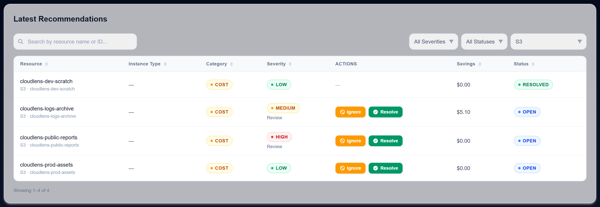</td>
<td width="50%"><b>RDS Findings</b><br>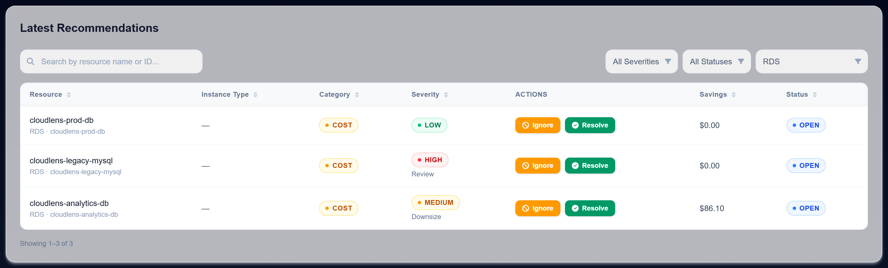</td>
</tr>
<tr>
<td colspan="2"><b>Mobile Responsive View</b><br></td>
</tr>
</table>

## Architecture Diagrams

| Diagram | Description |
|---|---|
| [`architecture.png`](docs/diagrams/architecture.png) | Full system architecture — frontend to database and AWS |
| [`folder-structure.png`](docs/diagrams/folder-structure.png) | Annotated folder tree, both sides of the stack |
| [`api-flow.png`](docs/diagrams/api-flow.png) | The 9-stage request/response path every endpoint follows |
| [`backend-flow.png`](docs/diagrams/backend-flow.png) | Express middleware stack, auth, and error handling |
| [`frontend-flow.png`](docs/diagrams/frontend-flow.png) | React hooks → services → Axios → re-render cycle |
| [`scan-flow.png`](docs/diagrams/scan-flow.png) | What happens between "Run Scan" and the dashboard updating |
| [`recommendation-flow.png`](docs/diagrams/recommendation-flow.png) | Raw AWS data → mapper → analyzer → recommender → priced finding |
| [`database-schema.png`](docs/diagrams/database-schema.png) | All 9 MongoDB collections and their relationships |

## Roadmap

**✅ Implemented**

- Authentication (JWT, logout-everywhere)
- AWS account connection (encrypted at rest)
- EC2 / S3 / RDS / IAM scanners
- Recommendation engine (cost, security, performance, reliability)
- AI Insights (rule-based)
- Interactive dashboard & charts
- Scan history & per-scan detail
- Resource Details Drawer
- Cost estimation via live AWS pricing
- Scheduled scans (`node-cron`)
- Email notifications
- PDF report export
- Cost analytics trends
- Audit log

**🚧 Planned**

- CSV export
- Slack notifications
- AWS Cost Explorer integration
- CloudWatch Alarm integration
- AI-based cost forecasting
- Multi-cloud support — Azure, GCP

## Contributing

Contributions are welcome.

1. Fork the repo and create a branch: `git checkout -b feature/your-feature`
2. Make your changes — keep the layering intact (`routes → controllers → services → repositories` on the backend; presentational components stay presentational on the frontend)
3. Commit with a clear message and push: `git push origin feature/your-feature`
4. Open a pull request describing what changed and why

If you're proposing something larger than a bug fix, opening an issue first to discuss the approach is appreciated.

## License

Distributed under the MIT License. See [`LICENSE`](LICENSE) for the full text.

## Author

**Akshat Johri**

[](https://github.com/Akshat295)

<div align="center">
<sub>Built with the MERN stack and the AWS SDK v3.</sub>
</div>
